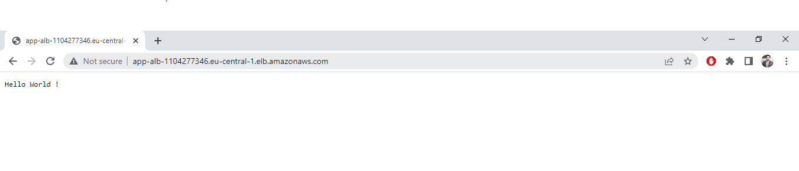

## Infrastructure Engineering Task
* All infrastructure is deployed on AWS
* Terraform is used as Infrastructure as Code tool (IaC)
* Bash script (named as `AWSInfraBuilder.sh` in root folder) is provided to build the insrastructure
* App is accessible from Application load balancer at http://app-alb-1104277346.eu-central-1.elb.amazonaws.com/
* Working example can be seen as follows :
   

### Task Requirements
#### Desired state and current state :
| Desired State  | Current State |
| ------------- | ------------- |
| Application MUST be deployed on virtual servers  | Application is deployed on EC2 instances via Launch Configuration   |
| There MUST be at least 2 nodes of the application  | Auto Scaling Group is configured with 2 minimum nodes  |  
| The nodes MUST be deployed in a dedicated private subnet | EC2 instances of python app are in private subnets - no direct access
| The nodes MUST be placed behind a load balancer | All nodes are behind the application load balancer (ALB)
| The application MUST be available as plain HTTP on port 80 or HTTPS on port 443 through the load balancer | Application is available as a plain HTTP on port 80 through the load balancer (working example can be seen above)
| There MUST be NO direct access to the nodes from the public. In particular there MUST be NO direct SSH access possible| There is no direct access to the nodes
| The load balancer SHOULD use health checks against the nodes to only route traffic to a node when the application has properly started |  Proper health checks are provided for the target group to route traffic
| The system SHOULD send an alert to a monitoring system when there are more than 10 requests in one minute to the application | AWS CloudWatch Metric Alarm is used for monitoring the number of requests to the application

### Prerequisite
* Intall terraform
* Please configure hashicorp vault, aws cli or to use environment variable for access and secret keys before buliding infrastructure using terrafom

### How to run
#### Method 1 : 
You can use the `AWSInfraBuilder.sh` script to build the infrastructure
* run this command `./AWSInfraBuilder.sh` or `bash AWSInfraBuilder.sh`
#### Method 2 :
Go inside `terraform` folder and use `terraform` commands to build the infrastructure
* Some useful commands :
    * `cd terraform` - change directory
    * `terraform init` - initializes a working directory containing Terraform configuration files
    * `terraform plan` - creates an execution plan, which lets you preview the changes that Terraform plans to make to your infrastructure
    * `terraform apply` - executes the actions proposed in a terraform plan
    * `terraform destroy` - terminates resources defined in your Terraform configuration

### Important key points
* According to requirements, there is no direct access to App servers
* All the security groups and ports are managed carefully according to the requirements
* Direct access is not possible - Just for the testing purposes, I have created a `Bastion Host` through which we can test the app server using this Bastion Host as a `Jump Server`
* Apart from requirements I have intentionally whitelisted `"Personal Home Network IP" and "VPN IP"` (VPN IP is dummy IP assuming this is the IP of VPN) to verify if resources are accessable via Bastion Host (in case if someone want to test; just replace "Personal Home Network IP" with their IP as mentioned in below code snippet) and then use follwing command to test (e.g., `ssh -A -J user@jump-server user@destination-server`)
```
# Define specific list of IP's for access
variable "whitelist_ips" {
  type = list(string)
  default = [
    "192.168.8.16/32",  # VPN IP
    "95.223.72.160/32", # Personal HomeNetwork IP for testing only
  ]
}
```
* Python app code is in Private GitHub repository
* For collaboration between multiple teams, it's a good practice to keep "terraform.tfstate" file on S3 backend instead of keeping it on VCS. I used remote state management with S3 backend for storage and dynamodb_table to enable locking

### Comments
* We can use `Ansible` as a separate tool for configuration managemet but for the simplicity I have kept the `app.py` code on GitHub
* We can use `terraform modules` to enhance reusability while working with different environments but I tried to keep it as simple as possible (because its just a small setup)